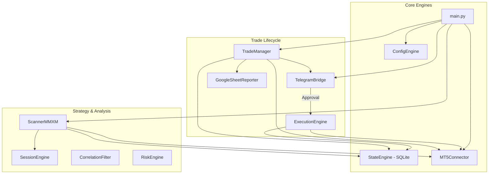

# 🌌 VvE FxBOT: High-Frequency MMXM Trading Engine

VvE FxBOT is a production-grade algorithmic trading system designed for MetaTrader 5. It implements the **MMXM (Market Maker Models)** framework, utilizing high-probability ICT concepts like Liquidity Sweeps, Displacement, and Fair Value Gaps (FVG) across multiple timeframes.

---

## 🏗️ System Architecture



---

## 📁 Project Structure & File Roles

### ⚡ Root Files
| File | Role |
| :--- | :--- |
| `main.py` | The master entry point. Coordinates all threads (Heartbeat, Scanner, Trade Manager). |
| `backtest.py` | CLI tool for historical testing. Supports MT5 auto-fetch or manual CSV replay. |
| `config.json` | Main system parameters: pairs, session timings, risk limits, and thresholds. |
| `backtest_config.json` | Specific settings for backtesting: date ranges, data source mode, and initial balance. |
| `db_view.py` | Utility script to print a formatted report of all trades stored in the local SQLite DB. |

### 🛠️ Core Folder (`core/`)
- `mt5connector.py`: Handles all direct communication with MetaTrader 5 (orders, history, live prices).
- `stateengine.py`: Manages the SQLite database for trade persistence and daily limits.
- `configengine.py`: Loads, validates, and provides a structured dataclass for `config.json`.
- `logger.py`: Centralized logging system with color-coded console output and file rotation.

### 🧩 Modules Folder (`modules/`)
- `scannermmxm.py`: **The Brain.** Implements M1/M15/H1 logic for ICT MMXM signal detection.
- `trademanager.py`: Monitors open positions. Handles TP1 partial closes, Breakeven shifts, and TP2 exits.
- `executionengine.py`: Manages the execution flow from Telegram approval to MT5 order placement.
- `telegrambridge.py`: Interface for human-in-the-loop approval and real-time status alerts.
- `riskengine.py`: Calculates lot sizes based on account equity and enforces hard risk-per-trade limits.
- `sessionengine.py`: Filters trades based on ICT Killzones (London, NY, Asia) and specific avoid windows.
- `correlationfilter.py`: Prevents over-exposure by blocking highly correlated pair setups (e.g., EURUSD vs GBPUSD).
- `reportgoogle.py`: Synchronizes all trade data to a professional Google Sheets dashboard.

### 🧪 Backtest Folder (`backtest/`)
- `engine.py`: Replays historical bars through the live scanner logic to simulate performance.
- `connector.py`: A virtual MT5 connector that feeds historical data instead of live ticks.
- `data/`: Storage for manual CSV exports if not using MT5 auto-fetch mode.
- `results/`: Automated CSV performance reports generated after every backtest run.

---

## 🚀 Getting Started

### 1. Prerequisites
- Python 3.10+
- MetaTrader 5 Terminal (Logged in to a Hedge account)
- Google Cloud Service Account (for Sheets reporting)

### 2. Installation
```bash
# Clone the repository
git clone https://github.com/your-repo/vvefxbot.git
cd vvefxbot

# Install dependencies
pip install -r requirements.txt
```

### 3. Configuration
1.  Rename `.env.example` to `.env` and add your MT5 credentials and Telegram Bot Token.
2.  Configure your trading parameters in `config.json`.

---

## 📈 Backtesting Suite

The FxBOT includes a high-fidelity backtester that uses the **exact same code** as the live scanner.

### Automatic MT5 Mode (Recommended)
1.  Set `"mode": "mt5"` in `backtest_config.json`.
2.  Ensure MT5 is open.
3.  Run: `python backtest.py`

### Manual CSV Mode
1.  Export M1 data from MT5 History Center.
2.  Place in `backtest/data/` as `EURUSD_M1.csv`.
3.  Set `"mode": "csv"` in `backtest_config.json`.
4.  Run: `python backtest.py`

---

## 🛡️ Risk Management
- **Static Risk:** Fixed % per trade calculated automatically.
- **Exposure Guard:** Max 6% total account risk open at any time.
- **Correlation Filter:** Prevents redundant trades on correlated pairs.
- **Daily Drawdown:** Auto-disables bot if daily loss limit is reached.
- **Slippage Protection:** Re-checks price at execution and rejects if slippage exceeds limits.

---

## 📊 Reporting
All trades are double-logged:
1.  **Local SQLite:** In `db/fxbot.db` for system recovery and state persistence.
2.  **Google Sheets:** Real-time updates for remote performance tracking.
